# Neural-Behavioral Representation of Natural Whole-body Movement in Monkeys

This repository is the official implementation of our paper "Neural-Behavioral Representation of Natural Whole-body Movement in Monkeys", including the model training code, as well as the monkey neural and behavioral data, and supplementary results.

## Pipeline

<div align="center">
  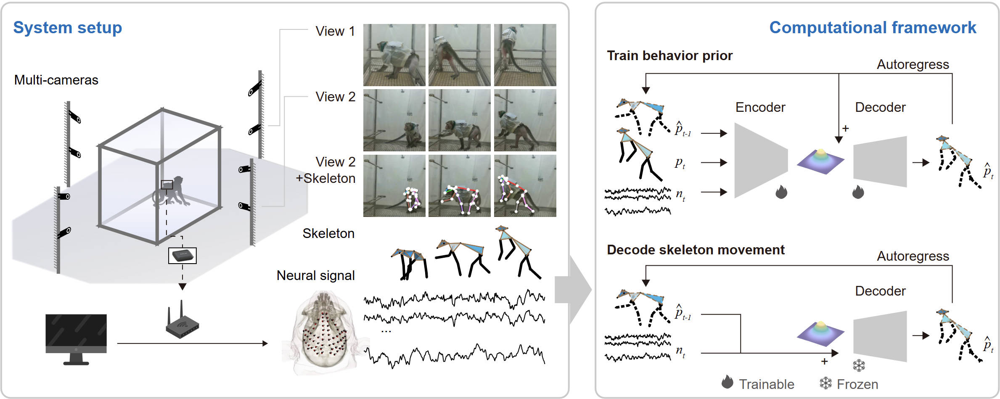
  <p> <b>Fig. Pipeline for decoding natural whole-body movement from epidural neural signals.</b> </p>
</div>
System setup: Whole-body movement data were captured using an 8-camera system and reconstructed into 3D skeleton. Computational framework: Collected data were divided into training and test sets. We trained a behavior prior on the training set by compressing movement data and neural signals into a latent space. Latent variables were then sampled and combined with the predicted state and the encoded neural signals, and further passed through the decoder to reconstruct the current state. During testing, only the decoder was used, and the movement states were reconstructed in the same autoregressive manner as during the training. 

## Train models

```
conda create -n [env_name]
conda activate [env_name]
pip install -r requirements.txt
python train_NB.py
```

## Description of the neural and behavioral data
We release the 30-minute datas reported in this paper. For longer recordings, please contact the corresponding authors.

`body_info.npz` include basic parameter of joint define and bonelength.

`init_state.npz, pose0_399.npy` denote the example root frame state and $p_0$ from an init state.

`mocap.npz` movement data of monkey kinematic representation, start with $p_0$.

`ecog_feature.mat` extracted `channel*band*timepoint` feature from neural signal, start with $p_5$.


## Reconstruction demos
<table>

  <tr>
    <td align="center" width="16.6%">GT</td>
    <td align="center" width="16.6%">Neural-Behavioral</td>
    <td align="center" width="16.6%">Behavioral</td>
    <td align="center" width="16.6%">GT</td>
    <td align="center" width="16.6%">Neural-Behavioral</td>
    <td align="center" width="16.6%">Behavioral</td>
  </tr>

  <tr>
    <td align="center">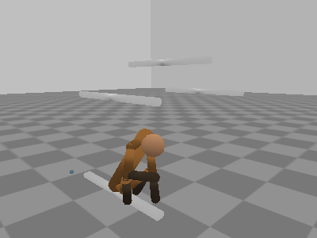</td>
    <td align="center"></td>
    <td align="center"></td>
    <td align="center">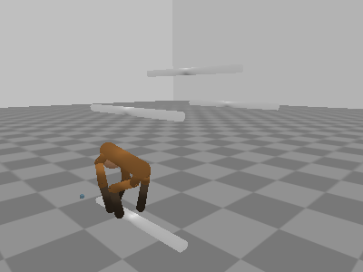</td>
    <td align="center">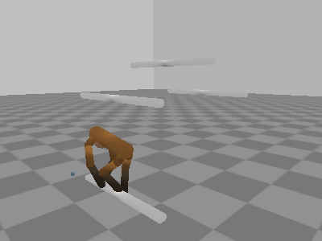</td>
    <td align="center">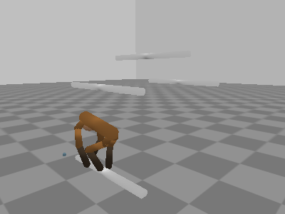</td>
  </tr>

  <tr>
    <td align="center" width="16.6%">GT</td>
    <td align="center" width="16.6%">Neural-Behavioral</td>
    <td align="center" width="16.6%">Behavioral</td>
    <td align="center" width="16.6%">GT</td>
    <td align="center" width="16.6%">Neural-Behavioral</td>
    <td align="center" width="16.6%">Behavioral</td>
  </tr>


  <tr>
    <td align="center"></td>
    <td align="center"></td>
    <td align="center">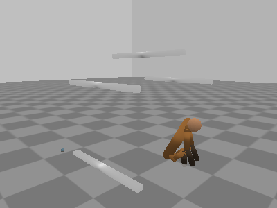</td>
    <td align="center">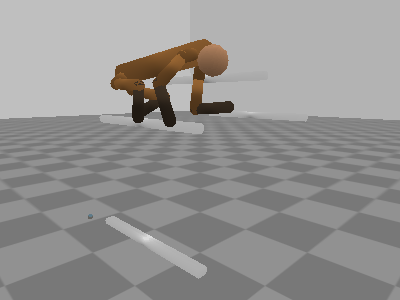</td>
    <td align="center">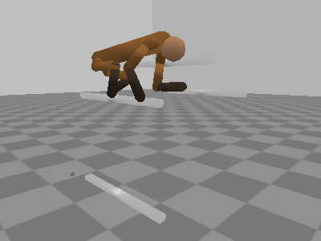</td>
    <td align="center">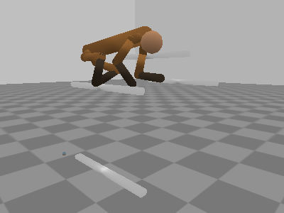</td>
  </tr>

  <tr>
    <td align="center" width="16.6%">GT</td>
    <td align="center" width="16.6%">Neural-Behavioral</td>
    <td align="center" width="16.6%">Behavioral</td>
    <td align="center" width="16.6%">GT</td>
    <td align="center" width="16.6%">Neural-Behavioral</td>
    <td align="center" width="16.6%">Behavioral</td>
  </tr>

  <tr>
    <td align="center">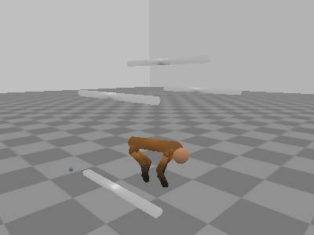</td>
    <td align="center">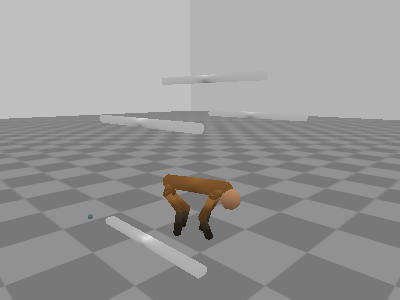</td>
    <td align="center">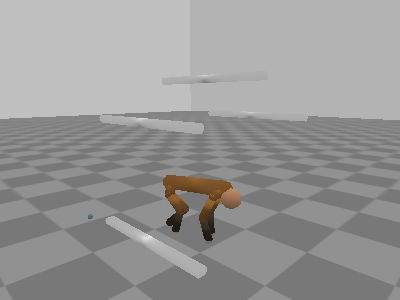</td>
    <td align="center">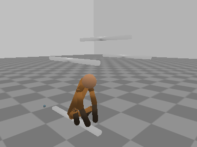</td>
    <td align="center"></td>
    <td align="center">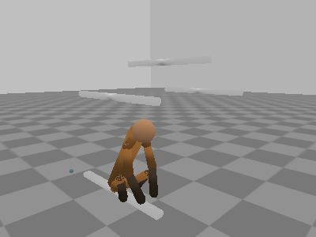</td>
  </tr>

  <tr>
    <td align="center" width="16.6%">GT</td>
    <td align="center" width="16.6%">Neural-Behavioral</td>
    <td align="center" width="16.6%">Behavioral</td>
    <td align="center" width="16.6%">GT</td>
    <td align="center" width="16.6%">Neural-Behavioral</td>
    <td align="center" width="16.6%">Behavioral</td>
  </tr>

  <tr>
    <td align="center"></td>
    <td align="center"></td>
    <td align="center">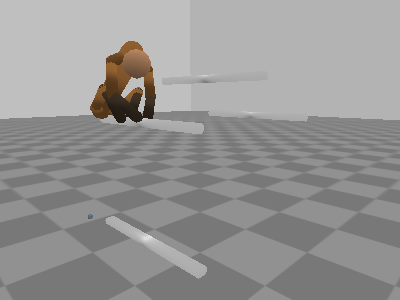</td>
    <td align="center">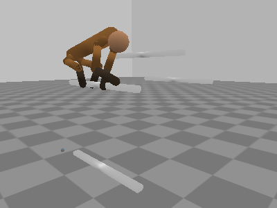</td>
    <td align="center">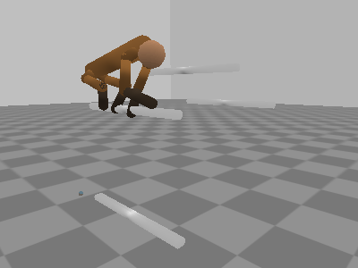</td>
    <td align="center"></td>
  </tr>

    <tr>
    <td align="center" width="16.6%">GT</td>
    <td align="center" width="16.6%">Neural-Behavioral</td>
    <td align="center" width="16.6%">Behavioral</td>
    <td align="center" width="16.6%">GT</td>
    <td align="center" width="16.6%">Neural-Behavioral</td>
    <td align="center" width="16.6%">Behavioral</td>
  </tr>

  <tr>
    <td align="center"></td>
    <td align="center">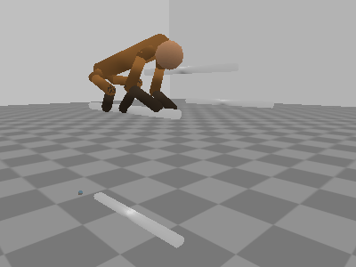</td>
    <td align="center"></td>
    <td align="center"></td>
    <td align="center">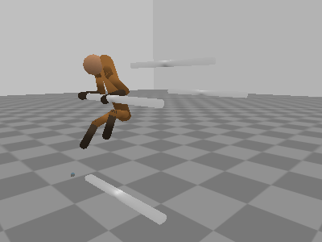</td>
    <td align="center">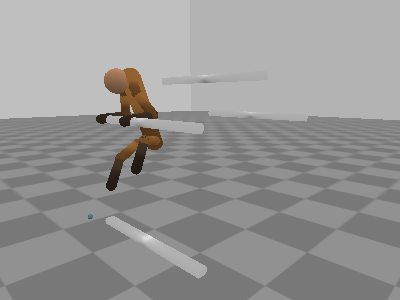</td>
  </tr>

</table>
